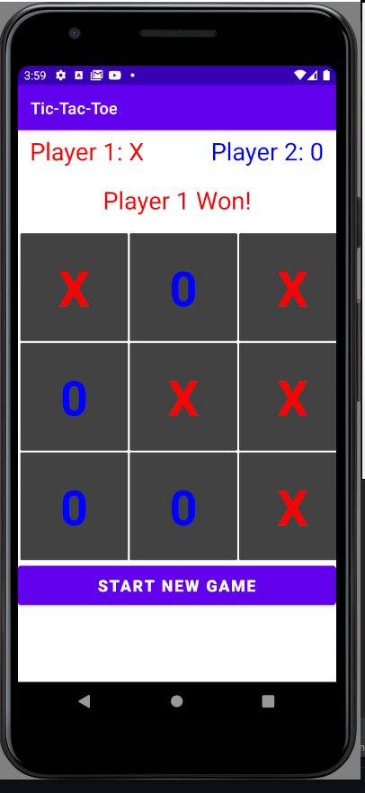
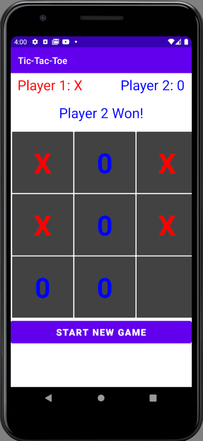

# Tic-Tac-Toe - Multi-threading using Handlers in Android 
Android Application that uses the concept of Handlers to perform multithreading in a Tic Tac Toe game.

## About The App
Tic-Tac-Toe is a 2 player game where the players alternate in turns to complete a row, column or diagonal with X or 0.  
In this implementation, we have two threads that play the game against each other.  
At the end of the game, the UI is updated with either of the 3 possible outcomes:
1. Player 1 Wins
2. Player 2 Wins
3. Game Tied

## Implementation
This required the use of Handlers, Loopers and MessageQueues in Android.

## Setting up the environment
After cloning the repository, import the project into Android Studio. Setup an emulator using AVD manager. The application supports API level 30 (Android 11) and above. The application can then be launched directly and does not require any permission.

## Screenshots
<table>
    <tr>
        <td>
            
        </td>
        <td>
            
        </td>
    </tr>
</table>
